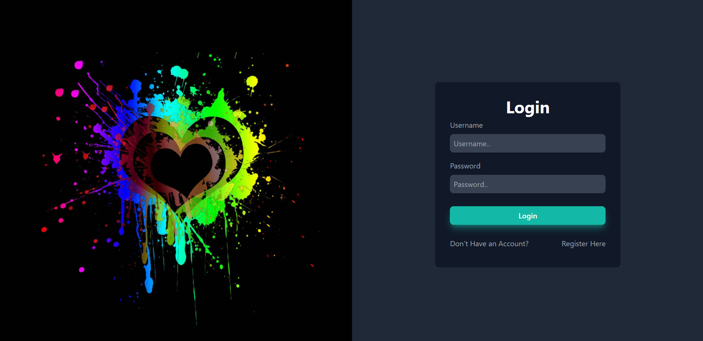
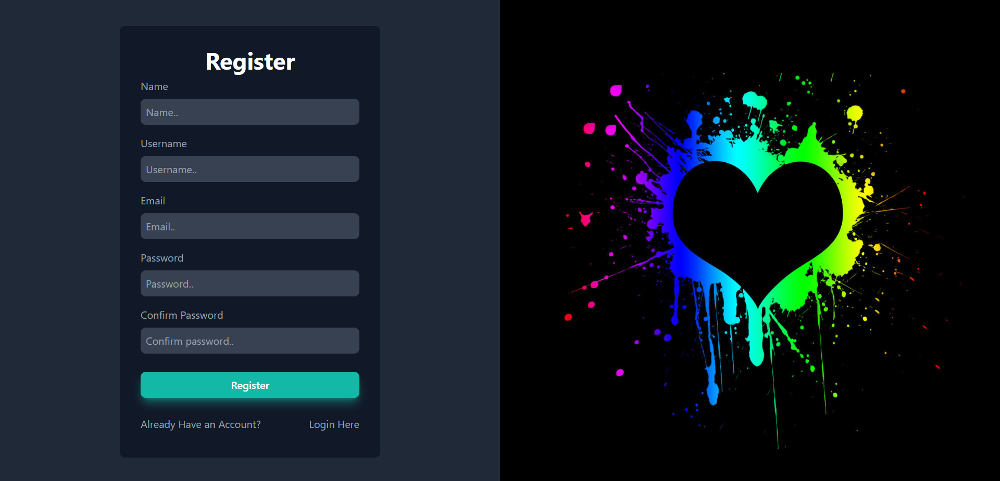

# IF3110 Pengembangan Aplikasi Berbasis Web

> _This is a project done to fulfil one of IF3110's course assignment._

## Description
   Aplikasi ini merupakan aplikasi berbasis web yang memiliki fungsionalitas utama seperti platform musik terkenal **SPOTIFY**. Aplikasi ini dibuat dengan menggunakan beberapa bahasa pemograman dan library. Bahasa dan Tools yang digunakan di antaranya JavaScript, React Js, Tailwind untuk  client side, Node Js untuk server side, dan MYSQL untuk penyimpanan database.
   Halaman yang terdapat pada aplikasi ini adalah sebagai berikut:
   * Login
   * Register
   * Homepage
   * Pengelolaan lagu
   * List Permintaan Subscription

## Requirements
Untuk menjalankan program pastikan Anda telah mendownload dan menginstall hal-hal berikut:
1. Teks Editor
2. JavaScript
3. XAMPP
4. MySQL

## How To Install
1. Teks Editor yang kami sarankan adalah Visual Studio Code yang panduan download dan installnya dapat dilihat pada tautan berikut ini [vscode](https://www.belajarisme.com/tutorial/install-vscode/#:~:text=Sekarang%20mari%20kita%20install%20VSCode%20dengan%20cara%20berikut,Select%20Star%20Menu%20Folder%20klik%20Next.%20More%20items)
2. Panduan instalasi JavaScript dapat dilihat pada tautan berikut [JS](https://www.duniailkom.com/javascript-uncover-panduan-belajar-javascript-untuk-pemula/)
3. Panduan instalasi XAMPP dapat dilihat pada tautan berikut [XAMPP](https://webhostmu.com/cara-install-xampp/#:~:text=Cara%20Install%20XAMPP%20di%20Windows%201%201%29%20Download,8%29%20Tunggu%20proses%20instalasi%20selesai%20...%20More%20items)
4. Panduan instalasi MySQL dapat dilihat pada tautan berikut [MySQL](https://www.duniailkom.com/tutorial-mysql-download-install-dan-setingan-awal-mysql/)
## How To Run
Buka folder htdocs yang berada di dalam folder XAMPP, lalu clone repository ini. Selanjutnya pada terminal jalankan command "npm start"

## Screenshot
1. Halaman Login 
2. Halaman Register 
3. Halaman Homepage
4. Halaman Pengelolaan Lagu 
5. Halaman List Permintaan Subscription 
## Authors
<table>
  <tr >
      <td><b>Frontend Halaman MySongs</b></td>
      <td><b>Frontend Halaman List Permintaan Subscription</b></td>
      <td><b>Frontend Halaman Login Register</b></td>
    </tr>
    <tr >
      <td><a href="https://gitlab.informatika.org/Aloysiusgilang"><b>13520147 - Aloysius Gilang Pramudya</b></a></td> 
        <td><a href="https://gitlab.informatika.org/leoniantoinette"><b>13520051 - Flavia Beatrix Leoni Antoinette Santoso</b></a></td>
        <td><a href="https://gitlab.informatika.org/febryola"><b>13520140 - Febryola Kurnia Putri</b></a></td>
   </tr>
</table>
